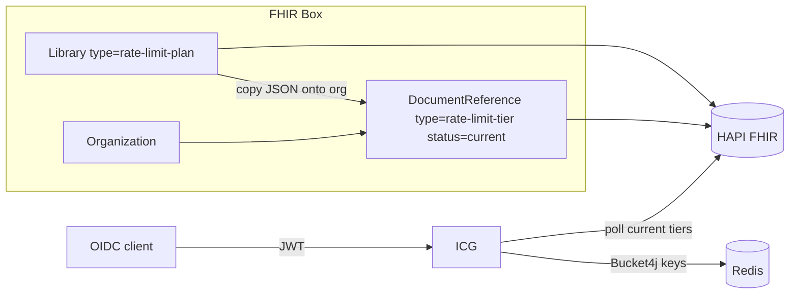

# FHIR Box

FHIR Box is a hands-on explorer for [FHIR](https://hl7.org/fhir/). Use it to browse resources, try search, walk relationships, and inspect what a FHIR server can do.

It runs as a Spring Cloud Gateway host for a Bootstrap / jQuery UI. The gateway authenticates the browser, serves the app, and proxies API calls to [HAPI FHIR JPA Starter](https://github.com/hapifhir/hapi-fhir-jpaserver-starter).

Security is switchable:

- **local** — application-managed users (form login)
- **oidc** — authorization-code login with Keycloak (or any OIDC provider)

## Requirements

- Java 21+
- Docker and Docker Compose v2 (for Keycloak, HAPI FHIR, Elasticsearch, and WireMock)
- Maven Wrapper is included (`./mvnw`)

````shell
docker network create fhir-box-network
````

## Quick start (local users)

```bash
./mvnw spring-boot:run
```

Open http://localhost:8080 and sign in with `admin` / `admin` (or `clinician` / `clinician`).

The SPA is served from the gateway. Calls to `/fhir/**` are proxied to HAPI FHIR at `http://localhost:8081`, `/wiremock/**` is proxied to WireMock at `http://localhost:9090`, `/core-admin-bridge/**` is proxied to Core Admin Bridge at `http://localhost:8280`, `/fhir-chief/**` is proxied to FHIR Chief at `http://localhost:8380`, and `/icg/**` is proxied to Integrator Connect Gateway at `http://localhost:8480` (start those stacks separately).

## Live reload (DevTools)

`spring-boot-devtools` is on the runtime classpath when you start from Maven or an IDE. It watches `target/classes` and reloads after a compile:

- **Java / configuration** — DevTools performs a fast application restart
- **Static SPA files** (`src/main/resources/static/**`) — copied onto the classpath and served without a restart (caching is disabled in the `local` profile)

Start the gateway and leave it running:

```bash
./mvnw spring-boot:run
```

After you edit Java, YAML, HTML, CSS, or JS, compile so DevTools sees the classpath change:

```bash
./mvnw compile
```

In IntelliJ IDEA use **Build → Build Project** (or enable automatic build while the app is running). In Eclipse, saving a file is enough.

Then refresh the browser. DevTools is not included in the packaged jar (`java -jar`), so production starts are unchanged.

## HAPI FHIR JPA Starter

````shell
docker network create fhir-box-network
````

```bash
docker compose -f docker/fhir/compose.yml up -d
```

| Service | URL / port |
| --- | --- |
| HAPI FHIR | http://localhost:8081 |
| FHIR API (via HAPI) | http://localhost:8081/fhir |
| FHIR API (via gateway) | http://localhost:8080/fhir |
| PostgreSQL | localhost:5432 (`admin` / `admin`, database `hapi`) |
| Elasticsearch | http://localhost:9200 |

HAPI assigns **UUID** resource IDs (`hapi.fhir.server_id_strategy: UUID`). Recreate the Postgres volume after changing `fhir_version` or the ID strategy.

Hibernate Search is on and uses Elasticsearch (`hibernate.search.backend.type: elasticsearch`), including HAPI’s ngram index settings (`ca/uhn/fhir/jpa/elastic/index-settings.json`). Full-text `_content` and `_text` searches are enabled (`hapi.fhir.search_index_full_text_enabled`). Recreate the HAPI container after changing this YAML. If a previous start failed while creating indexes, recreate the Elasticsearch volume too (`docker compose -f docker/elasticsearch/compose.yml down -v && docker compose -f docker/fhir/compose.yml up -d`). Resources written before Search was enabled need a HAPI `$reindex` to appear in those indexes.

REST-hook subscription processing is on (`hapi.fhir.subscription.resthook_enabled`). After changing `docker/fhir/hapi.application.yaml`, restart the HAPI container (`docker compose -f docker/fhir/compose.yml up -d --force-recreate hapi-fhir`). Subscription endpoints must be reachable from that container (for WireMock on the host, use `http://host.docker.internal:9090/...`).

The gateway route `/fhir/**` forwards to `cadmin.fhir.uri` (default `http://localhost:8081`) and strips the browser session cookie so HAPI does not see it. In OIDC mode the same route also applies `TokenRelay` so the access token is sent downstream.

Override the FHIR origin:

```bash
export CADMIN_FHIR_URI=http://localhost:8081
```

## Keycloak (OIDC)

```bash
docker compose -f docker/keycloak/compose.yml up -d
./mvnw spring-boot:run -Dspring-boot.run.profiles=oidc
```

| Service | URL / port |
| --- | --- |
| Keycloak | http://localhost:8180 |
| Admin console | http://localhost:8180 (`admin` / `admin`) |
| Realm | `cadmin` (imported from `docker/keycloak/realm/cadmin-realm.json`) |
| PostgreSQL | localhost:5433 (`keycloak` / `keycloak`, database `keycloak`) |

Imported application users:

- `admin` / `admin` (realm roles `admin`, `user`)
- `clinician` / `clinician` (realm role `user`)

Confidential client `cadmin-gateway` uses secret `cadmin-gateway-secret` and redirect URI `http://localhost:8080/login/oauth2/code/keycloak`. It has default scope `icg` and optional scope `icg.admin`. Resource-server client `icg` is the access-token audience for Integrator Connect Gateway. The gateway service account needs `view-clients`, `query-clients`, and `manage-clients` (plus the existing user roles) so administrators can manage realm clients from `#/oidc-clients`.

OIDC subjects are stored as FHIR identifiers with system `https://insulet.com/fhir/identifier/oidc/subject`. Users map to Practitioner. Clients map to Organization using the service-account JWT `sub`.

Keycloak `--import-realm` only creates the realm when it is missing. After changing `cadmin-realm.json`, recreate the Keycloak volume (`docker compose -f docker/keycloak/compose.yml down -v && docker compose -f docker/keycloak/compose.yml up -d`) or add the ICG scopes in the admin console.

Issuer and client settings can be overridden:

```bash
export CADMIN_OIDC_ISSUER=http://localhost:8180/realms/cadmin
export CADMIN_OIDC_CLIENT_ID=cadmin-gateway
export CADMIN_OIDC_CLIENT_SECRET=cadmin-gateway-secret
```

## Start both backing stacks

```bash
docker compose up -d
```

That include file starts FHIR (with Elasticsearch), Keycloak, WireMock, and Redis together. Run the gateway on the host so the browser, Spring, and Keycloak all share `localhost` hostnames.

## WireMock

```bash
docker compose -f docker/wiremock/compose.yml up -d
```

| Service | URL / port |
| --- | --- |
| WireMock | http://localhost:9090 |
| Admin API (direct) | http://localhost:9090/__admin |
| Admin API (via gateway) | http://localhost:8080/wiremock/__admin |

The gateway route `/wiremock/**` forwards to `cadmin.wiremock.uri` (default `http://localhost:9090`), strips the first path segment, and removes the browser session cookie. The WireMock admin pages in the SPA (`Mappings`, `Requests`, `Scenarios`) call that proxy. Stubbed HTTP APIs remain available on port 9090.

Override the WireMock origin:

```bash
export CADMIN_WIREMOCK_URI=http://localhost:9090
```

## Core Admin Bridge

Core Admin Bridge is a Spring Boot Camel engine with the Camel actuator and developer console. The Integrations sidebar page reads those endpoints through the gateway.

| Service | URL / port |
| --- | --- |
| Core Admin Bridge | http://localhost:8280 |
| Actuator (direct) | http://localhost:8280/actuator |
| Camel console (via gateway) | http://localhost:8080/core-admin-bridge/actuator/camel |

The gateway route `/core-admin-bridge/**` forwards to `cadmin.core-admin-bridge.uri` (default `http://localhost:8280`), strips the first path segment, and removes the browser session cookie.

Override the Core Admin Bridge origin:

```bash
export CADMIN_CORE_ADMIN_BRIDGE_URI=http://localhost:8280
```

## FHIR Chief

FHIR Chief is a sibling service (`../fhir-chief`) that owns slot generation, `$find` / `$hold` / `$book` / `$cancel` / `$reschedule` / `$propose`, hold expiry, waitlist promotion, and PlanDefinition `$apply` / `$advance` / `$cancel`. HAPI remains the store. Booking and plan runs from FHIR Box go through Chief, not raw `POST /Appointment` or HAPI `$apply`.

| Service | URL / port |
| --- | --- |
| FHIR Chief | http://localhost:8380 |
| Status (via gateway) | http://localhost:8080/fhir-chief/status |

```bash
cd ../fhir-chief
./mvnw spring-boot:run
```

The gateway route `/fhir-chief/**` forwards to `cadmin.fhir-chief.uri` (default `http://localhost:8380`), strips the first path segment, and removes the browser session cookie.

Override the FHIR Chief origin:

```bash
export CADMIN_FHIR_CHIEF_URI=http://localhost:8380
```

## Custom libraries

FHIR Box authors FHIR `Library` resources with custom `type` codes. Admins manage them under **Libraries** in the sidebar.

| Type | Content | UI |
| --- | --- | --- |
| `pds-policies` | Policy YAML (`application/x-policy+x-yaml`) | **PDS Policies** |
| `camel-route` | Camel YAML (`application/camel+yaml`) | **Camel Routes** |
| `easy-rule` | Easy Rules YAML (`application/easy-rules+yaml`) | **Easy Rules** |
| `rule-set` | Lure engine parameters JSON (`application/rule-set+json`) | **Rule Sets** |
| `gateway-route` | Spring Cloud Gateway YAML (`application/gateway+yaml`) | **ICG Routes** |
| `jolt` | Jolt transform JSON (`application/jolt+json`) and optional samples (`application/jolt-samples+json`) | **Jolt** |
| `rate-limit-plan` | ICG client quotas JSON (`application/icg-rate-limit+json`) | **Rate-limit plans** |

The Jolt editor **Transform** action posts `{ "input", "spec" }` to `POST /jolt/$transform` on this gateway (same contract as FHIR Chief) and does not call FHIR Chief.

## Integrator Connect Gateway

Integrator Connect Gateway is a sibling Spring Cloud Gateway (`../integrator-connect-gateway`) that polls FHIR `Library` resources with `type=gateway-route` and deploys their YAML as live HTTP routes. Author those libraries in FHIR Box under **ICG Routes**. The Integrations page **Integrator Connect Gateway** shows what is currently deployed.

| Service | URL / port |
| --- | --- |
| Integrator Connect Gateway | http://localhost:8480 |
| Status (via gateway) | http://localhost:8080/icg/status |

```bash
cd ../integrator-connect-gateway
./mvnw spring-boot:run
```

The gateway route `/icg/**` forwards to `cadmin.icg.uri` (default `http://localhost:8480`), strips the first path segment, and removes the browser session cookie. In OIDC mode the same route applies `TokenRelay`. ICG accepts `SCOPE_icg` for deployed routes and `SCOPE_icg.admin` (or Box realm `ROLE_ADMIN`) for `/status` and actuator. Access tokens must include audience `icg`.

Override the Integrator Connect Gateway origin:

```bash
export CADMIN_ICG_URI=http://localhost:8480
```

## Client rate limiting

Integrator Connect Gateway (ICG) rate-limits **OIDC clients**, not people. FHIR Box authors the policy; ICG polls FHIR, caches the current policy per client, and consumes tokens from Redis (or an in-memory store) on each request. Do not use Spring Cloud Gateway `RequestRateLimiter` for this.



### What you author

Two FHIR resources, both using the same JSON content type `application/icg-rate-limit+json`.

| Resource | Type code | Role | UI |
| --- | --- | --- | --- |
| `Library` | `rate-limit-plan` | Reusable template (defaults, groups, dedicated endpoints) | **Libraries → Rate-limit plans** |
| `DocumentReference` | `rate-limit-tier` | Per-organization assignment, bound to one OIDC client | Organization **Rate-limit tiers**, or **Libraries → Rate-limit tiers** |

A plan is a template. A **tier** is a live copy of that JSON assigned to an organization. ICG only enforces a tier when:

- `DocumentReference.status` is `current` (Box marks sibling org tiers `superseded` when you activate one)
- `DocumentReference.type` or `category` is `rate-limit-tier`
- An identifier exists with system `https://insulet.com/fhir/identifier/oidc/client-id`
- The attachment is valid JSON with a required `policyVersion`

Creating a tier from an organization copies an **active** plan library (or a custom JSON body), sets `subject`/`custodian` to that organization, and stamps the org’s OIDC client id when Box is in OIDC mode. The source library is recorded on extension `https://insulet.com/fhir/StructureDefinition/rate-limit-plan-source`.

### Policy JSON

```json
{
  "tier": "gold",
  "policyVersion": "1.0.0",
  "defaults": { "requestsPerMinute": 60, "requestsPerDay": 10000 },
  "groups": {
    "clinical-read": {
      "requestsPerMinute": 40,
      "requestsPerDay": 5000,
      "endpoints": ["patient_search", "patient_read"]
    }
  },
  "endpoints": {
    "jolt_ratings": { "requestsPerMinute": 10, "requestsPerDay": 500 }
  }
}
```

| Field | Meaning |
| --- | --- |
| `tier` | Label only (for example `gold`). Not used in the Redis key. |
| `policyVersion` | Required. Part of every Redis key. Bump it when limits change so counters start over. Box prompts to increment on save if rates changed. |
| `defaults` | Limits for routes that are not in a group or dedicated endpoint list, and for group/endpoint rows that “use defaults” (those rows omit numbers in JSON). |
| `groups` | Named pools. All listed ICG route ids share **one** bucket. A route id may appear only once in the whole plan. |
| `endpoints` | Dedicated pools. Each listed ICG route id gets its own bucket. |
| `requestsPerMinute` / `requestsPerDay` | Typical quotas. Must satisfy **rps ≤ rpm ≤ rpd** for whichever fields are set. |
| `requestsPerSecond` | Optional. Omitted unless the “Limit requests per second” switch is on. |

A value of `0` on any set window denies every request immediately. Unset windows are not enforced.

### How a request is limited

1. The ICG route YAML must include the `ClientRateLimit` filter. ICG does not inject it automatically.

```yaml
- id: patient_read
  uri: https://httpbin.org
  predicates:
    - Path=/Patient/**
  filters:
    - StripPrefix=0
    - ClientRateLimit=patient_read,30,2000
```

Shortcut arguments are `endpoint`, `requestsPerMinute`, `requestsPerDay`, optional `requestsPerSecond`. `endpoint` defaults to the Gateway route id. YAML numbers apply **only** when ICG has no cached FHIR policy for that client.

2. ICG polls `DocumentReference?type=rate-limit-tier` on the same interval as route libraries (default 30s). `status=current` documents are parsed into an in-memory map keyed by OIDC client id. Anything else evicts that client from the cache.

3. On each request, ICG resolves the client id from the JWT: `azp`, then `client_id`, then `preferred_username` when it starts with `service-account-` (prefix stripped). In local (permit-all) mode, JWT is skipped and `X-ICG-Client-Id` is used instead.

4. The route id is matched against the policy: **group** (shared pool) first, then **dedicated endpoint**, otherwise **defaults** as an unlisted endpoint bucket.

5. Bucket4j consumes **one token from every configured window** (second, minute, and/or day). Refill is interval-based: the full capacity is restored at the end of each window. Counters live in Redis at:

```text
icg:rl:{clientId}:{policyVersion}:group:{groupId}
icg:rl:{clientId}:{policyVersion}:endpoint:{routeId}
```

### Fail-closed vs skip

| Mode | No client id | No cached policy | Over quota | Store down |
| --- | --- | --- | --- | --- |
| OIDC | **403** Client identity is required | **403** Rate limit policy is required | **429** + `Retry-After` | **503** |
| Local | Pass through (unless `X-ICG-Client-Id` is set) | Pass through (unless YAML fallback rates are present) | **429** + `Retry-After` | **503** |

Successful and throttled responses also set `X-RateLimit-Remaining` and `X-RateLimit-Limit` (the tightest configured window: second, else minute, else day).

### Watching live usage

- **Integrator Connect Gateway** (`#/icg`) lists cached policies as OIDC rate-limit clients.
- `#/icg/clients/{clientId}` polls `GET /icg/status/rate-limits/{clientId}` every 2 seconds for remaining tokens. Unused buckets report full capacity.

Set `icg.rate-limit.store=redis` (ICG default) and start Redis (`docker/redis/compose.yml` via the FHIR Box stack, or `ICG_REDIS_URI`). `memory` is for tests only: counters do not survive restarts and are not shared across ICG instances.

## Configuration

| Property | Default | Purpose |
| --- | --- | --- |
| `cadmin.security.mode` | `local` | `local` or `oidc` |
| `cadmin.security.users` | admin, clinician | Local form-login accounts |
| `cadmin.fhir.uri` | `http://localhost:8081` | Downstream HAPI FHIR origin |
| `cadmin.wiremock.uri` | `http://localhost:9090` | Downstream WireMock origin |
| `cadmin.core-admin-bridge.uri` | `http://localhost:8280` | Downstream Core Admin Bridge origin |
| `cadmin.fhir-chief.uri` | `http://localhost:8380` | Downstream FHIR Chief origin |
| `cadmin.icg.uri` | `http://localhost:8480` | Downstream Integrator Connect Gateway origin |
| `spring.cloud.gateway.server.webflux.routes` | `/fhir/**`, `/wiremock/**`, `/core-admin-bridge/**`, `/fhir-chief/**`, `/icg/**` | Additional proxy routes |

Local users are defined in `src/main/resources/application.yml`. Passwords are treated as plaintext unless they already use a Spring `{id}` prefix such as `{bcrypt}...`.

Add another backend by appending a route:

```yaml
spring.cloud.gateway.server.webflux.routes:
  - id: other-api
    uri: http://localhost:8090
    predicates:
      - Path=/other-api/**
    filters:
      - StripPrefix=1
```

## Project layout

```
src/main/java/io/cadmin/gateway/   Gateway, security, JSON API
src/main/resources/static/          FHIR Box UI (Bootstrap / jQuery)
docker/fhir/                        HAPI FHIR + PostgreSQL
docker/keycloak/                    Keycloak + PostgreSQL + realm import
docker/wiremock/                    WireMock mappings and files
```

## Tests

```bash
./mvnw test
```

## Jolt Transforms in ICG

ICG now has a JoltTransform response filter. It uses the same Jolt stack as FHIR Chief (jolt-complete 0.2.0) and the same FHIR jolt Library resources that FHIR Box edits.

Route YAML

````yaml
- id: ratings
  uri: https://httpbin.org
  predicates:
    - Path=/ratings/**
      filters:
    - StripPrefix=1
    - name: JoltTransform
      args:
      name: ratings
      version: "^1.2.0"
      Shortcut: - JoltTransform=ratings,^1.2.0
````

name is Library.name. version is an exact SemVer (1.2.3) or a semver4j range (^1.2.0, >=1.0.0 <2.0.0). If several active libraries share that name, ICG uses the highest matching version.

Hot swap
JoltLibraryPoller uses the same interval and rules as ICG routes / CAB Camel routes: first poll is a full snapshot; later polls are incremental on _lastUpdated. Active specs are cached as Chainr; draft/retired/missing libraries are evicted; a spec change replaces the cached transform. /status now includes joltLibraries.

JSON responses are rewritten before they go back to the client. Non-JSON bodies pass through. No matching library or a failed transform returns 502.

The ICG route editor in FHIR Box has a Jolt JSON response template and JoltTransform in the YAML hints. ICG tests passed. Restart ICG to pick this up.

# On Subscriptions and CAB Routes

One approach is to create a subscription and Camel route for each interested
consumer. This isolates consumers from each other, but produces more artifacts
to manage.

Another approach is to create a single subscription for the event and to create
a single route that relays that event to all the interested consumers. This
keeps the number of artifacts down, but incurs additional complexity in the
routes and does not allow for isolation of consumers.

Lookup SSE (server-sent events) lightweight alernative to websockets